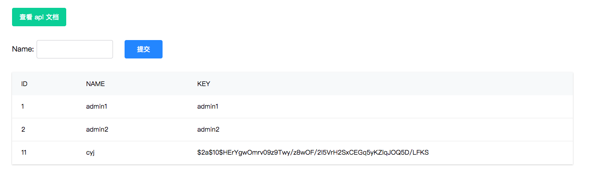
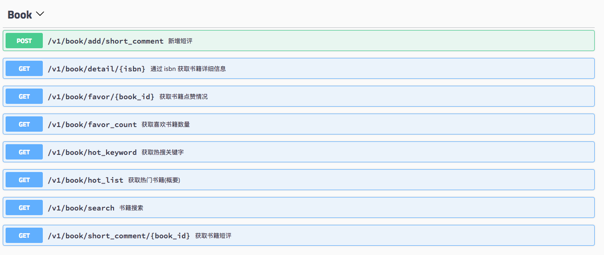
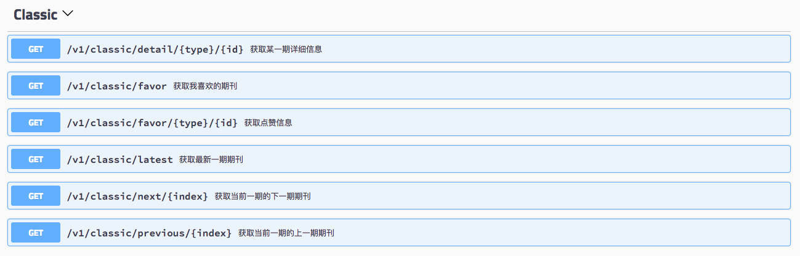
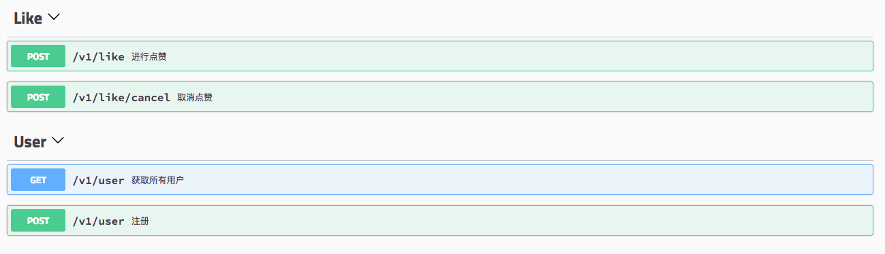

# 《旧岛小样》小程序的 api server
```bash
# dev
cd 7yue_api_server
cp config/config.yaml.default config/config.yaml
make install
make dev

# pro
make
./admin.sh start
# 之后可打开 localhost:8886 注册 key 以及查看 api 文档
```








